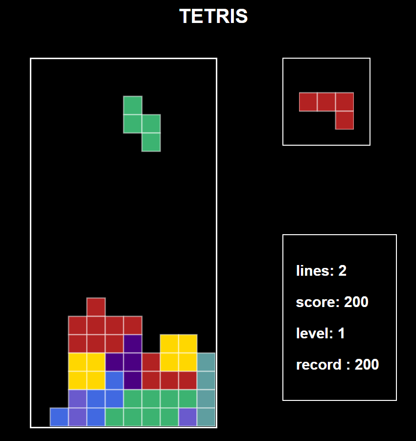

# Проект: TETRIS

### О проекте:
Игра тетрис, логика и функционал написаны при помощи JS, 2D графика на Canvas

  

### Используемые технологии:
- 2D графика - Canvas;
- OOП;
- Управление фигурами, счетчик очков, рандомная следующая фигура, уничтожение линий - JS;
- Музыкальное сопровождение игры;

### Стек:

- HTML
- CSS
- Java Script

&nbsp;
&nbsp;
&nbsp;

[Здесь можно поиграть](https://elenasharnina.github.io/TETRIS/)

### Управление:
 RIGHT 	&#9658;
 
 LEFT 	&#9668;
 
 DOWN 	&#9660;
 
 ROTATE  	&#9650;
 
